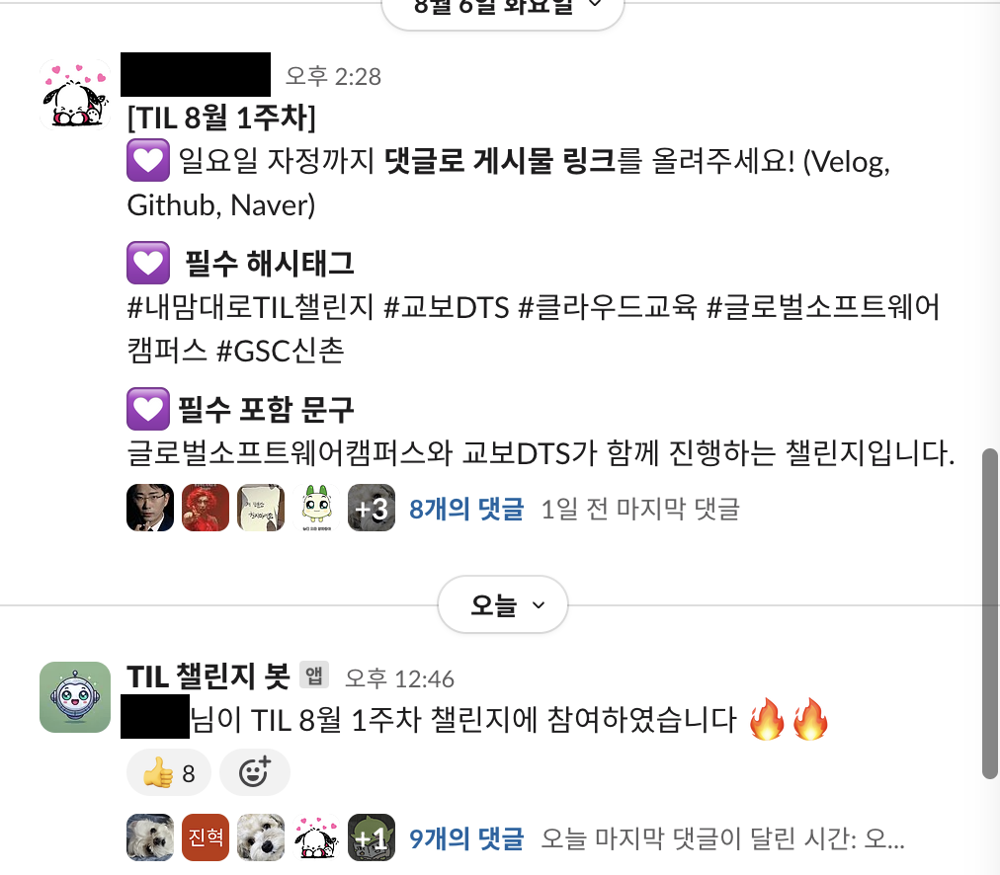
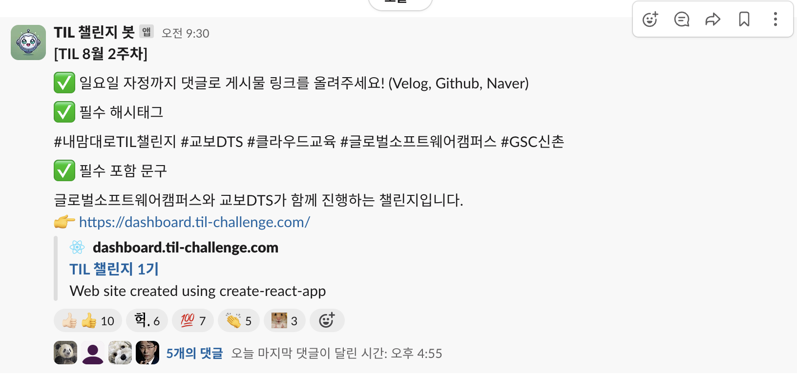
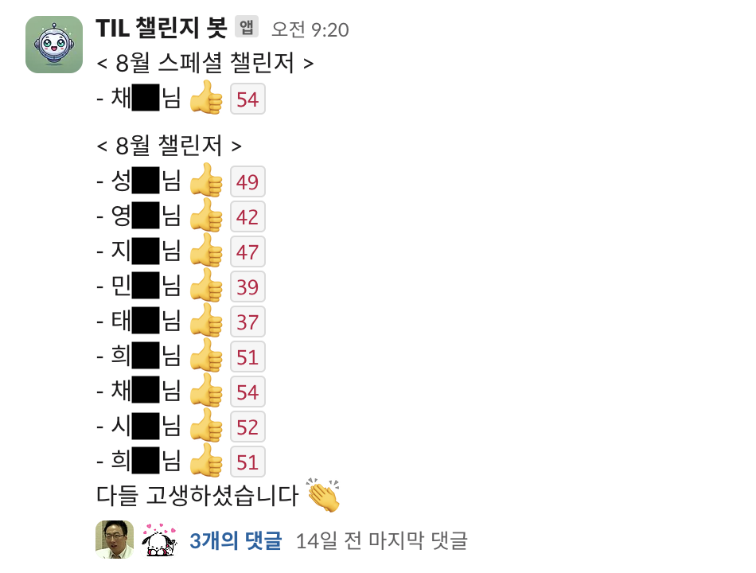
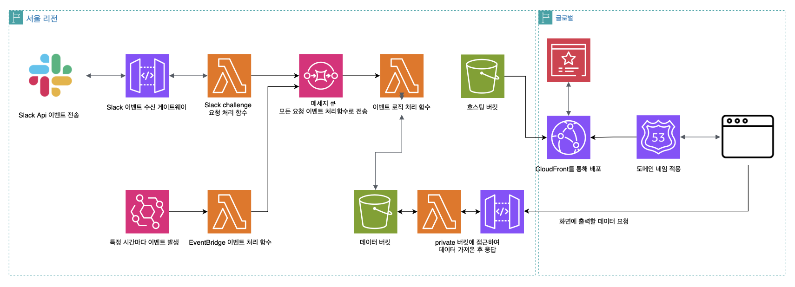

# TIL CHALLENGE BOT 🤖

## 🎯 프로젝트 소개

이 프로젝트는 교보 CDA 1기 과정의 TIL 챌린지를 지원하기 위해 진행되었습니다. 매니저님들이 직접 수행하던 챌린지 글 게시, 좋아요 집계, 월별 주차별 참여 인원 선정 작업을 TIL 챌린지 봇을 통해 자동화하였으며, 주차별 참여 인원과 좋아요 수를 웹페이지에서 한눈에 볼 수 있도록 시각화했습니다.

> 💡 **TIL 챌린지란?** 
> 매주 `TIL N월 N주차`라는 메시지를 슬랙(Slack)에 게시하면, 멤버들은 해당 메시지에 답글로 자신이 작성한 블로그 글의 URL을 올립니다. 다른 사용자들은 해당 글을 읽고, 마음에 들면 좋아요(👍)를 눌러 서로의 학습 내용을 격려하고 공유합니다.

## 🎯 배경

TIL 챌린지에서는 매주 매니저님이 `TIL N월 N주차`라는 메시지를 슬랙에 게시하고, 멤버들은 해당 메시지에 답글로 블로그 글의 URL을 공유합니다. 그러나 기존 시스템에서는 답글을 단 멤버 외에는 알림이 가지 않아, 챌린지에 참여하지 않은 멤버들은 새로운 글이 올라왔는지 인지하지 못하는 경우가 발생했습니다. 이로 인해, `서로의 공부 내용을 공유한다`는 TIL 챌린지의 취지를 충분히 달성하지 못한다고 판단했습니다. 
이를 개선하기 위해, Slack API를 활용하여 TIL 챌린지에 새로운 답글이 달릴 때마다 채널의 모든 멤버에게 알림이 가도록 했습니다. 또한, 매니저님이 매주 월요일마다 수동으로 올리던 TIL 챌린지 게시글을 자동으로 게시하도록 했으며, 매달 모든 주차에 참여한 멤버들과 그 중 가장 많은 좋아요(👍)를 받은 멤버를 선정하는 과정(N월 챌린저 선정)을 자동화하였습니다. 마지막으로, 각 멤버별로 받은 👍 개수를 집계하여 이를 간단한 웹 페이지로 시각화했습니다.

## 🎯 기간

- 개발 기간: 2024.07.24 ~ 2024.08.05
- 운영 기간: 2024.08.06 ~ 2024.12.02

## 🎯 주요 기능

#### 1️⃣ TIL 챌린지 참여 및 알림

- TIL 챌린지 게시글에 멤버가 자신의 블로그 글과 함께 답글을 올리면 TIL 챌린지 채널에 `OO 님이 TIL N월 N주차 챌린지에 참여하였습니다 🔥🔥` 라는 메세지가 올라오고 참여한 것으로 데이터에 반영됩니다.
- 채널에 알림 메세지가 게시되므로 TIL 채널의 멤버 모두에게 알림이 갑니다.
- Velog, Github, Naver 블로그 링크를 같이 올리지 않으면 챌린지에 참여한 것이 아니므로 참여여부에 반영이 되지않고 알림 또한 가지 않습니다.
- 텍스트만 올린 메세지에 편집해서 자신의 블로그 링크를 넣으면 참여한 것이며 알림이 갑니다.
- 참여한 답글을 삭제하면 참여하지 않은 것으로 데이터에 반영됩니다.

  

#### 2️⃣ 좋아요(👍) 집계

- TIL 챌린지 게시글에 작성된 참여 답글에 👍 이 추가되거나 제거된경우 해당 답글을 작성한 멤버의 👍 수에 반영됩니다.
- 오직 TIL 챌린지 글에 있는 답글의 👍 만 반영됩니다.
- 다른 피부색의 👍 리액션도 모두 집계됩니다.
- 👍 이외의 리액션은 반영되지 않습니다.

#### 3️⃣ 챌린지 메세지 게시 및 챌린저 선정 자동화

- 매주 월요일마다 채널에 `TIL N월 N주차` 게시글을 자동으로 올립니다. N월 N주차는 그 날의 날짜를 이용해 계산하였습니다.
  

    
  

- 매달 첫번째 월요일에 선정된 N월 챌린저 멤버 리스트를 자동으로 게시합니다.
  - `N월 챌린저 선정: N월 모든 주차에 참여한 멤버와 그중 가장 많은 좋아요를 받은 멤버를 선정하여 선물을 증정`
  - 예를들면 9월 첫번째 월요일에 8월 챌린저에 선정된 멤버를 종합해 채널에 게시합니다.
  

    
  

#### 4️⃣ 주차별 참여 및 좋아요 통계 페이지 제공

- 주차별 챌린지 참여인원에 대한 좋아요 통계 페이지를 제공합니다.

  

#### 5️⃣ Slack 개인 DM으로 상태 메세지 전송

- 챌린지 참여 글에 대한 👍 리액션이 추가되거나 삭제될 때, 해당 리액션이 적용된 글에 대한 상태 알림 메시지가 본인 DM으로 전송됩니다.
- 에러가 발생할 경우, 모든 에러 메시지가 본인 DM으로 전송됩니다.

## 🎯 내가 고려한 부분

- [왜 서버리스로 구현함?](docs/%EC%99%9C%20%EC%84%9C%EB%B2%84%EB%A6%AC%EC%8A%A4%EB%A1%9C%20%EA%B5%AC%ED%98%84%ED%95%A8%3F.md)
- [문제점과 개선한점](docs/%EB%AC%B8%EC%A0%9C%EC%A0%90%EA%B3%BC%20%EA%B0%9C%EC%84%A0%ED%95%9C%EC%A0%90.md)
- [Slack Api 이벤트 처리](docs/Slack%20Api%20%EC%9D%B4%EB%B2%A4%ED%8A%B8%20%EC%B2%98%EB%A6%AC.md)

## 🎯 기술 스택

  
  

  
  
  
  

  

## 🎯 시스템 아키텍처

