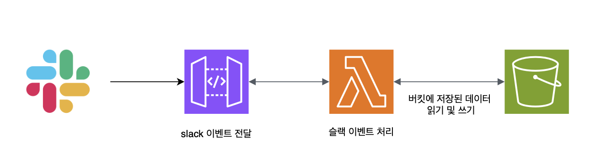
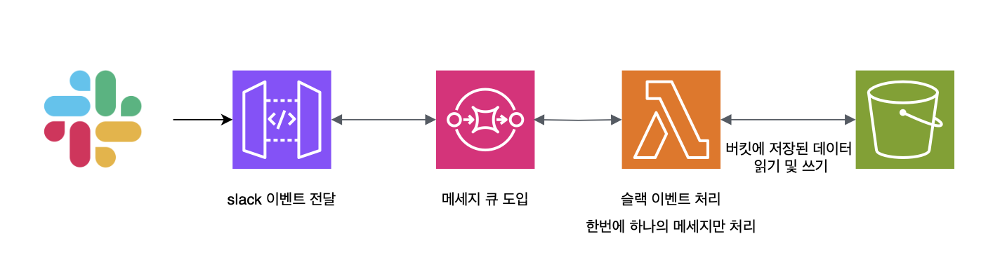
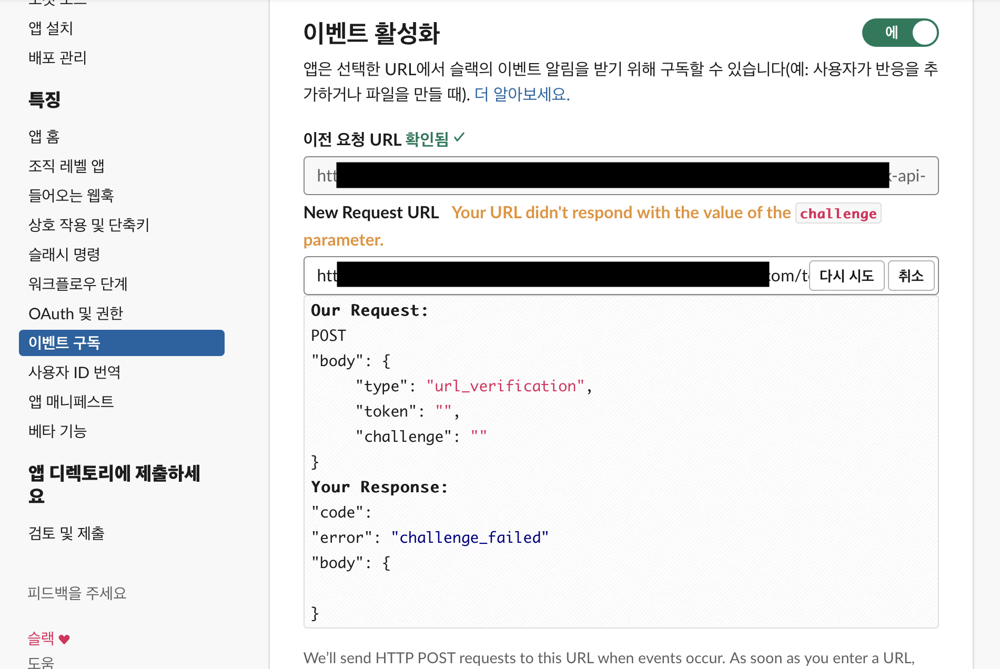
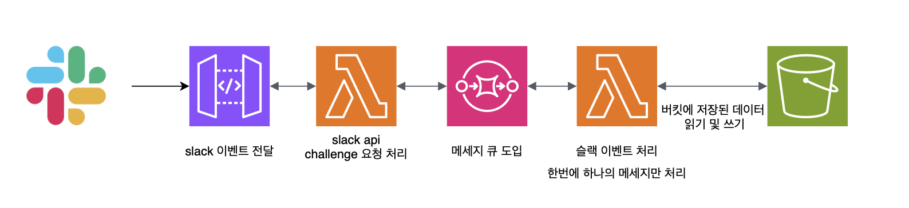
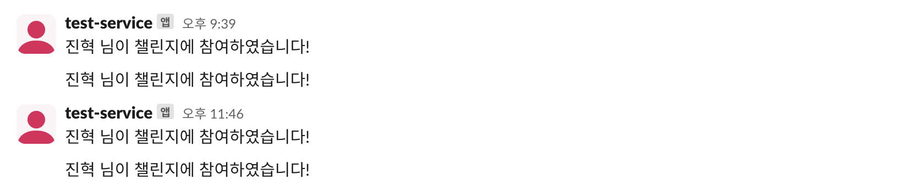

## 🤔 문제 1 - S3 동시성 문제


기존에는 위의 사진과 같이 API Gateway -> Lambda -> S3 순서로 요청을 처리했고, 요청이 많지 않아서 S3에 데이터를 저장해 사용했습니다. 하지만 S3는 파일 락 기능을 제공하지 않으므로, 여러 사용자가 동시에 동일한 객체를 읽거나 쓸 때 데이터의 무결성이 보장되지 않을 수 있습니다.</br>
예를 들어, A라는 멤버와 B라는 멤버가 동시에 챌린지에 참여하여 자신의 블로그 글을 남깁니다. 이때, 람다는 동일한 S3 데이터를 로드하여 각 멤버의 글을 처리합니다. A가 작성한 글의 타임스탬프 값을 먼저 S3에 저장하지만, 동시에 B도 동일한 S3 데이터를 가져와 자신의 글의 타임스탬프 값을 저장하려 합니다. 만약 A가 먼저 데이터를 변경하고 이를 S3에 저장한 후, B가 변경된 데이터를 인지하지 못하고 자신의 데이터를 저장하게 되면, A의 변경 사항이 덮어쓰여져 챌린지에 참여했지만 데이터에 반영이 되지 않을 수 있습니다.

### 📈 문제 개선 - SQS 도입


S3의 동시성 문제를 방지하기 위해 AWS의 SQS를 도입했습니다. 람다 함수에 SQS를 트리거로 설정하여, 각 요청이 큐에 도착하면 이를 순차적으로 처리하도록 했습니다. FIFO 큐를 사용해 메시지의 순서를 보장하고, 한 번에 하나의 메시지만 처리하도록 배치 수를 1로 설정하여, 동시에 여러 요청이 S3에 접근하지 않도록 했습니다. 이를 통해 S3의 동시성 문제를 해결하여 안전하게 요청을 처리할 수 있도록 해주어 문제를 개선했습니다.

---

## 🤔 문제 2 - Slack Api challenge 요청


Slack 이벤트를 구독하기 위해선 위와같이 이벤트를 받을 url을 입력하고 검증 받아야합니다. 검증은 challenge 요청을 통해서 이루어집니다. Slack에서 challenge 요청을 보내면 내가 등록한 애플리케이션에서 받은 challenge 값을 그대로 담아 응답하고 Slack에서 응답 값을 보고 url을 확인합니다.</br>
하지만 Api Gateway - Sqs - Lambda 순서에서는 Slack의 challenge 요청에 대한 정확한 응답이 오지 않아 url 확인이 되지 않았습니다. 이 문제는 Sqs가 메세지를 비동기적으로 처리하여서 요청값이 즉시 응답으로 반환되지 않기 때문입니다. Slack은 challenge 값을 바로 반환받기를 원하지만 Lambda 에서 challenge 값을 응답으로 넣어 Api Gateway에게 반환했을 시점에는 이미 Api Gateway에서 Slack 측으로 Sqs 메세지 처리 성공에 대한 응답을 보내기 때문에 url 검증이 이미 종료된 상태입니다. 이것을 순서대로 정리하면 아래와 같습니다.

1. Slack에서 Api Gateway url로 challenge 요청
2. Api Gateway는 요청을 Sqs 로 전달
3. Sqs는 메시지를 큐에 저장하고, 성공적으로 큐에 추가되었음을 API Gateway에 알림
   > Sqs가 Api Gateway 에게 보내는 응답

   ```json
   {
     "SendMessageResponse": {
       "ResponseMetadata": {
         "RequestId": "512e9a6c-3767-5b5a-8d63-c54onq25dcd4"
       },
       "SendMessageResult": {
         "MD5OfMessageAttributes": null,
         "MD5OfMessageBody": "965d3ab203nd9f691393462fb98dvb823b",
         "MD5OfMessageSystemAttributes": null,
         "MessageId": "9df80cb1-e0e5-410a-81e9-13b52faf4df6",
         "SequenceNumber": "35711232581098878848"
       }
     }
   }
   
   응답 헤더:
   {
     "Content-Type": "application/json",
     "X-Amzn-Trace-Id": "Root=1-66ade902-a394b71770cd6628c6dfff09"
   }
   ```

4. Api Gateway는 Sqs 응답을 기반으로 Slack에게 응답을 반환
   - 이 응답에는 challenge 값이 없고, 대신 Sqs 메시지 처리 성공에 대한 정보만 포함됨
5. Lambda에서 메세지를 처리하여 challenge 값 반환
   - 이 시점에선 이미 Api Gateway가 Slack에게 응답을 반환했으므로 challenge 검증요청이 종료된 상태임

### 📈 문제 개선 - challenge 요청을 처리하는 람다 함수 추가

이러한 문제를 해결하기 위해 API Gateway 와 SQS 사이에 람다 함수를 추가했습니다. Slack Api 에서 오는 challenge 요청은 추가한 람다함수에서 처리해서 검증을 받고, 이외의 요청은 모두 메세지 큐로 보내주도록 해주었습니다. 물론, Slack의 이벤트 URL 검증이 구독 시 한 번만 수행되기 때문에, 잠시 동안 SQS를 배제하고 challenge 요청만 처리한 후 검증이 완료되면 SQS를 다시 포함시켜주어도 됩니다.</br>
하지만, 이는 유연성이 떨어질 수 있습니다. 나중에 URL이 변경되거나, 다른 Slack 앱을 만들어 이벤트를 구독할 때도 다시 이 과정을 반복해주어야합니다. 또한, 이는 올바른 API 사용 방법이 아니라고 생각했습니다. 그래서 저는 아래와 같이 Api Gateway와 Sqs 중간에 challenge 요청을 처리하는 람다함수를 만들어 위의 문제를 개선하였습니다.


---

## 🤔 문제 3 - Slack 이벤트 중복 요청


이 애플리케이션은 사용자가 TIL 챌린지 게시글에 답글을 작성하면 채널에 누가 챌린지에 참여했다고 메세지를 보냅니다. 하지만 테스트 워크스페이스에서 이 시스템을 테스트하고 있을 때 스레드 답글을 하나만 작성했는데 위와 같이 채널에 메세지가 두개씩 올라오는 것을 확인했습니다. 계속 이런 문제가 발생하지는 않았지만 가끔씩 이벤트가 연달아 두번 요청되는 것을 확인했습니다.
이 문제는 앱이 event 요청에 대해 3초 이내로 응답을 하지못해 Slack에서 전달에 실패했다고 생각해 다시 요청을 보내는 것이었습니다. 실제 두번 요청이 왔을 때 두번째 요청 데이터를 확인하면 요청 헤더에 `x-slack-retry-num: 1` 필드가 있었습니다. 앞의 요청을 실패했다고 가정해 한번더 동일한 이벤트 요청을 보낸 것입니다.</br>
하지만 실제로 제가 사용하는 데이터를 확인해보니 중복된 값이 들어가 있는 것을 확인했습니다. 즉, 요청은 잘 처리되었지만, 응답이 늦게 가서 슬랙이 요청을 한번더 보내 중복된 데이터가 들어간 것이었습니다.

> 참고 자료</br>
> [Slack Events Api 공식문서](https://api.slack.com/apis/events-api#errors)</br>
> [중복된 이벤트를 수신하는 슬랙 이벤트 리스너 for reddit](https://www.reddit.com/r/Slack/comments/12kr9oj/slack_event_listener_receiving_duplicates_of/?rdt=54716)

### 📈 문제 개선 - 철저한 예외처리

중복된 요청으로 인한 데이터 중복 삽입을 방지하기 위해 예외 처리를 더욱 철저하게 개선했습니다. 예를들면, 각 메시지 이벤트의 고유 식별자인 timestamp 값을 사용하여, 해당 timestamp 값이 이미 데이터에 존재할 경우, 데이터에 삽입되지 않도록 했습니다. JSON 데이터 구조 특성상 키 값이 중복될 수 없기 때문에, timestamp 값을 키 값으로 사용하여 중복 삽입을 효과적으로 방지했습니다.</br>
또한, 이런 방식으로 중복을 피하더라도 `timestamps['timestamps'][this_month][ts] = til_text` 앞의 구문과 같이 바로 키 값에 넣어주게 되면 기존에 있던 데이터가 덮어씌여질 수 있기 때문에 이런 위험성이 있는 부분은 모두 먼저 데이터가 존재하는지 확인한 후 나머지 로직이 진행되도록 해주었습니다.이외에도 이벤트마다의 고유 값을 사용하여 데이터에 값이 있는지 먼저 검사한 후 나머지 로직이 진행되도록 해주었습니다.</br>
이 문제는 자주 발생하는 것은 아니었으며, 가끔 발생하는 문제였습니다. 이 문제를 발견한 시점은 Sqs를 도입하기 전, API Gateway - Lambda 로 구성되어 있을 때 발생했습니다. Sqs를 도입하면 Sqs가 요청을 바로 메시지 큐에 저장하고, 이를 성공적으로 받았다는 응답을 API Gateway에게 전달합니다. 이로 인해 Slack은 요청이 빠르게 처리되었다는 응답을 받을 수 있어 재요청이 발생할 가능성이 줄어들 것이라고 판단하였습니다. 그래도 혹시 모를 상황에 대비하여 더욱 철저하게 예외 처리를 강화했습니다.
